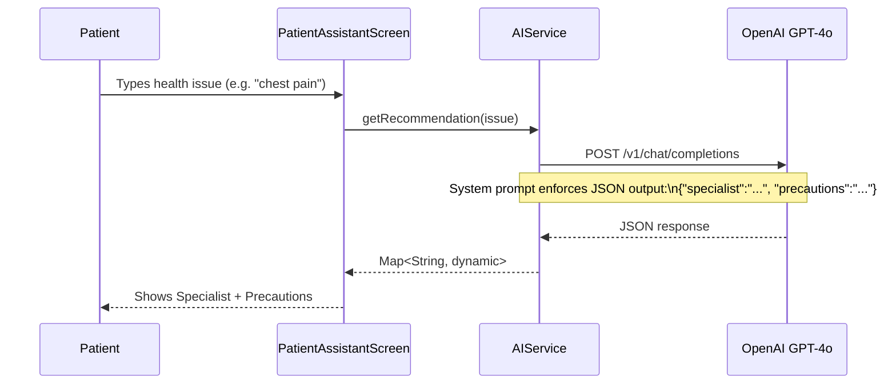

# ◈ Smart Hospital — Patient & Queue Management Platform ◈

[](https://flutter.dev)
[](https://dart.dev)
[](https://firebase.google.com)
[](https://openai.com)
[](https://pub.dev/packages/provider)
[](LICENSE)

**Smart Hospital** is a premium, full‑stack mobile application built with **Flutter & Firebase** that digitizes the entire patient journey — from registration and doctor discovery to live queue tracking, appointment management, medicine reminders, and AI‑powered health consultations. Designed with modern UI/UX principles, it delivers a seamless experience for **patients**, **doctors**, and **hospital administrators** from a single codebase targeting Android & iOS.

---

## ✦ Platform Philosophy & Visual Design

Smart Hospital is engineered around three core pillars:

- **Premium UI/UX:** Deep dark‑mode palette with vibrant gradient accents, Google Fonts (Outfit, Poppins, Inter), glassmorphism cards, and micro‑animations for a tactile, alive interface.
- **Real‑Time Everything:** Firebase Firestore powers live queue counters, appointment status, notifications, and chat — all streamed in real time without any manual refresh.
- **AI‑Augmented Care:** An embedded GPT‑4o assistant guides patients to the correct specialist and provides personalized precautions before they even step into a clinic.

---

## ⚙️ Core System Architecture

```mermaid
graph TD
    subgraph Flutter App [Flutter Mobile App — Android & iOS]
        A[Splash / Onboarding] --> B(Auth Layer)
        B --> C{Role Router}
        C --> D[Patient Dashboard]
        C --> E[Doctor Dashboard]
        C --> F[Admin Dashboard]
        D --> G[AI Health Assistant]
        D --> H[Live Queue Tracker]
        D --> I[Appointment Booking]
        D --> J[Medicine Reminder]
        D --> K[EasyPaisa Payment]
    end

    subgraph Firebase Cloud
        L[(Firestore DB)]
        M[Firebase Auth]
        N[Firebase Storage]
        O[FCM Push Notifications]
    end

    subgraph AI Layer
        P[OpenAI GPT-4o API]
    end

    Flutter App -->|REST / SDK| Firebase Cloud
    G -->|HTTPS API Call| P
    Firebase Cloud -->|Real-time Streams| Flutter App
```

---

## ✨ Outstanding Features

### 1. 🤖 AI‑Powered Patient Issue Assistant
- **GPT‑4o Integration:** Patient describes their health issue in natural language; the assistant returns the most appropriate specialist (Cardiologist, Neurologist, Dermatologist, etc.) using OpenAI's chat‑completion API.
- **Interim Precautions:** Alongside the specialist suggestion, the AI provides a curated list of self‑care precautions valid until the patient sees the doctor.
- **Structured JSON Parsing:** The service enforces a strict `{ "specialist": "...", "precautions": "..." }` output format for reliable parsing.
- **Error Resilient:** Gracefully handles API failures with user‑friendly error toasts and fallback messaging.

### 2. 🏥 Live Queue Tracking (Real-Time)
- **Live Token Counter:** Patients see their live position in the queue streamed directly from Firestore — no polling, no page refresh.
- **Queue History:** Full audit trail of past queue sessions with timestamps, doctor name, and outcome.
- **Doctor Queue Management:** Doctors can advance, skip, or mark patients as served from their dedicated dashboard.

### 3. 📅 Appointment Booking System
- **Multi‑Step Flow:** Doctor selection → Date selection → Time slot selection → Confirmation — each step with smooth slide transitions.
- **Doctor Availability:** Time slots are dynamically fetched from Firestore and marked as booked in real time.
- **Appointment History:** Patients can view, track, and cancel past and upcoming appointments.
- **Success Screen:** Premium animated confirmation screen with appointment token and doctor details.

### 4. 💊 Smart Medicine Reminder
- **Add / Edit / Delete Medicines:** Full CRUD for medication schedules with dosage, frequency, and timing.
- **Local Notifications:** `flutter_local_notifications` fires reminders at precise intervals, even when the app is backgrounded.

### 5. 💳 EasyPaisa Payment Integration
- **Seamless Checkout:** Integrated EasyPaisa gateway for appointment fee payment directly within the app.
- **Payment Success / Failure Screens:** Animated outcome screens with retry logic and transaction reference display.

### 6. 🔔 Push Notifications (FCM)
- **Firebase Cloud Messaging:** Real‑time push notifications for appointment confirmations, queue updates, and doctor messages.
- **In‑App Notification Centre:** Dedicated notification screen with read/unread state, timestamps, and navigation to relevant screens.

### 7. 👨‍⚕️ Doctor Dashboard
- **Patient Queue Management:** Accept, advance, or complete patient consultations.
- **Appointment Overview:** View all scheduled appointments with patient details and status.
- **Doctor Profile:** Manage specialization, experience, available days, and consultation fee.

### 8. 🛡️ Admin Dashboard
- **Manage Doctors:** Approve new doctor registrations, edit doctor profiles, and deactivate accounts.
- **Doctor Request Review:** Dedicated screen for pending doctor onboarding requests.
- **Patient Management:** View and manage the complete patient registry.

### 9. 🔒 Multi‑Role Auth with Firebase
- **Email/Password Auth:** Secure sign-up, login, and forgot-password flows.
- **Role‑Based Routing:** On login, the app routes to the correct dashboard (patient / doctor / admin) based on the Firestore `role` field.
- **Await Approval Screen:** Newly registered doctors are held in a pending state until approved by an admin.

---

## 📁 Repository Directory Structure

```
smart_hospital/
├── android/                    # Android native configuration
├── ios/                        # iOS native configuration
├── assets/
│   └── images/                 # App logo, illustrations, and assets
├── lib/
│   ├── main.dart               # App entrypoint — Firebase init & MultiProvider setup
│   ├── firebase_options.dart   # Generated Firebase configuration
│   ├── config/
│   │   └── api_config.dart     # API keys configuration (OpenAI, etc.)
│   ├── constants/
│   │   └── theme.dart          # AppTheme — light & dark mode definitions
│   ├── models/
│   │   ├── appointment.dart    # Appointment data model
│   │   ├── doctor.dart         # Doctor data model
│   │   ├── medicine.dart       # Medicine / reminder data model
│   │   ├── message.dart        # Chat message data model
│   │   ├── notification.dart   # Notification data model
│   │   ├── payment_model.dart  # Payment transaction model
│   │   └── user_profile.dart   # Patient profile model
│   ├── providers/
│   │   ├── auth_provider.dart          # Authentication state
│   │   ├── doctor_provider.dart        # Doctor list & state
│   │   ├── appointment_provider.dart   # Appointment CRUD state
│   │   ├── queue_provider.dart         # Live queue state
│   │   ├── medicine_provider.dart      # Medicine reminder state
│   │   ├── notification_provider.dart  # Notification state
│   │   ├── chat_provider.dart          # In-app chat state
│   │   ├── payment_provider.dart       # Payment flow state
│   │   └── theme_provider.dart         # Light / Dark theme toggle
│   ├── services/
│   │   ├── ai_service.dart             # OpenAI GPT-4o API wrapper
│   │   ├── firebase_service.dart       # Firebase initializer & helpers
│   │   ├── auth_service.dart           # Auth business logic
│   │   ├── doctor_service.dart         # Doctor Firestore operations
│   │   ├── appointment_service.dart    # Appointment Firestore operations
│   │   ├── queue_service.dart          # Queue Firestore operations
│   │   ├── medicine_service.dart       # Medicine local/Firestore operations
│   │   ├── notification_service.dart   # FCM & local notification logic
│   │   └── easypaisa_service.dart      # EasyPaisa payment gateway
│   ├── screens/
│   │   ├── splash_screen.dart              # Animated splash & auth guard
│   │   ├── Onboarding 1_screen.dart        # Onboarding step 1
│   │   ├── Onboarding 2_screen.dart        # Onboarding step 2
│   │   ├── login_screen.dart               # Email/password login
│   │   ├── signup_screen.dart              # New user registration
│   │   ├── forgot_password_screen.dart     # Password reset
│   │   ├── await_approval_screen.dart      # Doctor pending approval
│   │   ├── home_dashboard_screen.dart      # Patient home dashboard
│   │   ├── patient_assistant_screen.dart   # 🤖 AI Health Assistant
│   │   ├── doctor_list_screen.dart         # Browse all doctors
│   │   ├── search_doctor_screen.dart       # Doctor search
│   │   ├── doctor_detail_screen.dart       # Doctor profile & booking
│   │   ├── appointment_booking_screen.dart # Step 1 - Booking
│   │   ├── date_selection_screen.dart      # Step 2 - Date picker
│   │   ├── time_slot_selection_screen.dart # Step 3 - Time slot
│   │   ├── appointment_confirmation_screen.dart # Step 4 - Review
│   │   ├── appointment_success_screen.dart # Booking success
│   │   ├── appointment_history_screen.dart # Past & upcoming appointments
│   │   ├── live_queue_screen.dart          # Real-time queue tracker
│   │   ├── queue_history_screen.dart       # Queue audit log
│   │   ├── total_detailed_screen.dart      # Token detail view
│   │   ├── medicine_reminder_screen.dart   # Medicine list
│   │   ├── add_medicine_screen.dart        # Add medicine
│   │   ├── edit_medicine_screen.dart       # Edit medicine
│   │   ├── notification_screen.dart        # Notification centre
│   │   ├── profile_screen.dart             # Patient profile
│   │   ├── setting_screen.dart             # App settings & theme
│   │   ├── doctor_dashboard_screen.dart    # Doctor main dashboard
│   │   ├── doctor_profile_screen.dart      # Doctor profile editor
│   │   ├── manage_queue_screen.dart        # Doctor queue control
│   │   ├── admin_dashboard_screen.dart     # Admin control panel
│   │   ├── manage_doctor_screen.dart       # Admin — manage doctors
│   │   ├── admin/
│   │   │   ├── manage_patients_screen.dart
│   │   │   └── manage_doctor_requests_screen.dart
│   │   └── payment/
│   │       ├── payment_screen.dart         # EasyPaisa checkout
│   │       ├── payment_success.dart        # Payment success
│   │       └── payment_failed.dart         # Payment failure
│   ├── widgets/
│   │   └── payment_button.dart             # Reusable payment CTA widget
│   └── routes/
│       └── app_routes.dart                 # Centralized route registry & transitions
├── pubspec.yaml                            # Flutter dependencies
├── firestore.rules                         # Firestore security rules
├── storage.rules                           # Firebase Storage rules
└── firebase.json                           # Firebase project config
```

---

## 🛠️ Tech Stack & Dependencies

### Core Framework
| Package | Version | Purpose |
|---------|---------|---------|
| **Flutter SDK** | ^3.x | Cross-platform UI framework |
| **Dart** | ^3.x | Language runtime |

### Firebase & Backend
| Package | Version | Purpose |
|---------|---------|---------|
| `firebase_core` | ^3.12.0 | Firebase app initialization |
| `firebase_auth` | ^5.3.0 | Authentication (email/password) |
| `cloud_firestore` | ^5.4.0 | Real-time NoSQL database |
| `firebase_storage` | ^12.3.0 | Cloud file storage |
| `firebase_messaging` | ^15.1.0 | Push notifications (FCM) |

### State Management
| Package | Version | Purpose |
|---------|---------|---------|
| `provider` | ^6.1.5 | App-wide state management with `ChangeNotifier` |

### AI Integration
| Package | Purpose |
|---------|---------|
| `http` ^1.1.0 | HTTP calls to OpenAI GPT‑4o chat completions API |
| `dart:convert` | JSON encoding / decoding of AI responses |

### UI & UX
| Package | Version | Purpose |
|---------|---------|---------|
| `google_fonts` | ^8.1.0 | Premium typography (Outfit, Poppins) |
| `flutter_local_notifications` | ^17.2.3 | Medicine reminder local alerts |
| `image_picker` | ^1.2.2 | Profile photo upload |

### Utilities
| Package | Version | Purpose |
|---------|---------|---------|
| `connectivity_plus` | ^6.1.1 | Network connectivity detection |
| `shared_preferences` | ^2.2.3 | Lightweight local key-value storage |
| `uuid` | ^4.0.0 | Unique ID generation for tokens |
| `intl` | ^0.20.2 | Date & time formatting / localization |

---

## 🚀 Getting Started

### Prerequisites
- **Flutter SDK** (v3.x or higher) — [Install Flutter](https://docs.flutter.dev/get-started/install)
- **Dart** (bundled with Flutter)
- **Android Studio / VS Code** with Flutter & Dart plugins
- **Firebase Project** — [Firebase Console](https://console.firebase.google.com)
- **OpenAI API Key** — [OpenAI Platform](https://platform.openai.com/api-keys)

### Setup & Installation

#### 1. Clone the Repository
```bash
git clone https://github.com/your-org/smart-hospital.git
cd smart-hospital
```

#### 2. Install Flutter Dependencies
```bash
flutter pub get
```

#### 3. Configure Firebase
- Create a Firebase project at [console.firebase.google.com](https://console.firebase.google.com)
- Enable **Firestore**, **Authentication (Email/Password)**, **Storage**, and **Cloud Messaging**
- Download `google-services.json` → place inside `android/app/`
- Download `GoogleService-Info.plist` → place inside `ios/Runner/`
- Run FlutterFire CLI to regenerate `lib/firebase_options.dart`:
  ```bash
  dart pub global activate flutterfire_cli
  flutterfire configure
  ```

#### 4. Configure OpenAI API Key
Open `lib/config/api_config.dart` and replace the placeholder:
```dart
class ApiConfig {
  static const String openAIApiKey = 'YOUR_OPENAI_API_KEY_HERE'; // ← Replace this
}
```
> ⚠️ **Never commit your real API key to version control.** Consider using environment variables or a secure secrets manager in production.

#### 5. Run the App
```bash
# Run on connected Android/iOS device or emulator
flutter run

# Run on specific platform
flutter run -d android
flutter run -d ios
```

---

## 🔥 Firebase Firestore Collections

| Collection | Description |
|------------|-------------|
| `users` | Patient & doctor profiles, roles, and metadata |
| `doctors` | Doctor specializations, availability, and fees |
| `appointments` | Booking records with status, date, and time slot |
| `queues` | Live queue tokens with position and status |
| `medicines` | Patient medication schedules |
| `notifications` | FCM notification records per user |
| `messages` | In-app chat messages between patients and doctors |
| `payments` | EasyPaisa transaction records |

---

## 🌐 AI Health Assistant — How It Works



**Sample Prompt Structure:**
```
You are a medical triage assistant.
Given the patient's described issue, respond in JSON with two fields:
"specialist": "<specialty name>",
"precautions": "<short bullet list of self‑care steps>".
Only output valid JSON without any extra text.
Patient issue: {user_input}
```

---

## 🔒 Security Best Practices

- **Role-Based Access Control:** Firestore security rules enforce that patients, doctors, and admins can only read/write their own data.
- **API Key Protection:** OpenAI API key stored in `ApiConfig` — use `flutter_secure_storage` or Firebase Remote Config in production.
- **Firebase Auth Guards:** All Firestore collections require authenticated requests; anonymous access is denied.
- **Input Validation:** All user inputs validated client-side before submitting to Firestore or external APIs.
- **HTTPS Only:** All external API calls (OpenAI, EasyPaisa) made exclusively over HTTPS.

---

## ⚡ Team Rules & Git Workflow (STRICT)

> [!IMPORTANT]
> **Rule 1: Clean Codebase**
> Write self-documenting code. Meaningful variable and function names over excessive commenting.
>
> **Rule 2: Structured Architecture**
> Keep files in their designated folders: `screens/`, `services/`, `providers/`, `models/`. Never mix concerns.
>
> **Rule 3: Provider Pattern**
> All state lives in Providers. Screens must never directly call Firebase — always go through a Service → Provider → Screen chain.
>
> **Rule 4: Zero Empty Catch Blocks**
> Every `try/catch` must explicitly log or display the error. Silent failures are strictly prohibited.
>
> **Rule 5: Branch Protection**
> **Never push directly to `main`.** All changes go through a feature branch and require a Pull Request review.
>
> **Rule 6: No API Keys in Code**
> Never hard-code secrets. Use environment-based injection or secure storage in any deployment beyond local development.
>
> **Rule 7: Null Safety Compliance**
> All Dart code must be fully null-safe. No use of the `!` force-unwrap operator without explicit null-check guards.

---

## 🧪 Build & Testing

### Run Tests
```bash
flutter test
```

### Check for Analysis Issues
```bash
flutter analyze
```

### Production Build
```bash
# Android APK
flutter build apk --release

# Android App Bundle (Play Store)
flutter build appbundle --release

# iOS (requires Xcode on macOS)
flutter build ios --release
```

---

## 🤝 Contribution Workflow

1. Pull the latest updates from `main`:
   ```bash
   git checkout main
   git pull origin main
   ```

2. Create a feature branch with a descriptive name:
   ```bash
   git checkout -b feature/patient-ai-assistant
   ```

3. Commit using professional tags:
   - `feat: add AI health assistant screen`
   - `fix: resolve null pointer in queue provider`
   - `chore: update firebase dependencies`
   - `refactor: extract doctor service from provider`

4. Push and open a Pull Request targeting `main`:
   ```bash
   git push origin feature/patient-ai-assistant
   ```

---

## 🗺️ Roadmap

- [x] Multi-role Authentication (Patient / Doctor / Admin)
- [x] Live Queue Tracking with Firestore Streams
- [x] Appointment Booking Multi-Step Flow
- [x] Medicine Reminders with Local Notifications
- [x] EasyPaisa Payment Integration
- [x] AI Health Assistant (GPT-4o)
- [ ] Video Consultation (WebRTC / Agora)
- [ ] Prescription Generation & PDF Export
- [ ] Multi-language Support (Urdu / English)
- [ ] Wearable Integration (Heart Rate, SpO₂)
- [ ] Doctor Rating & Review System

---

<p align="center">
  Developed with 💙 by the Smart Hospital Development Team.<br>
  <b>Smart Hospital — Intelligent, Real-Time, Patient-First Healthcare.</b>
</p>
